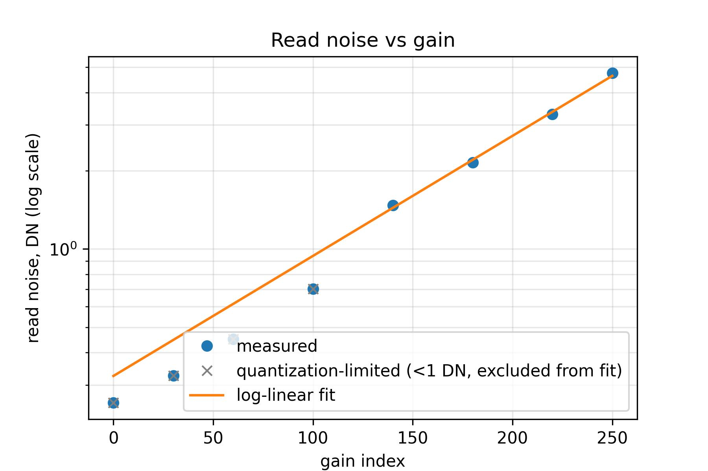
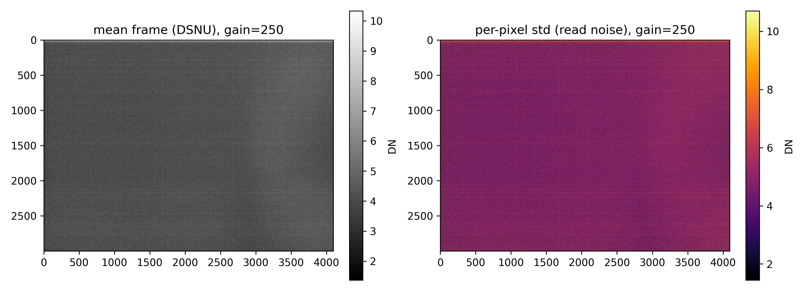
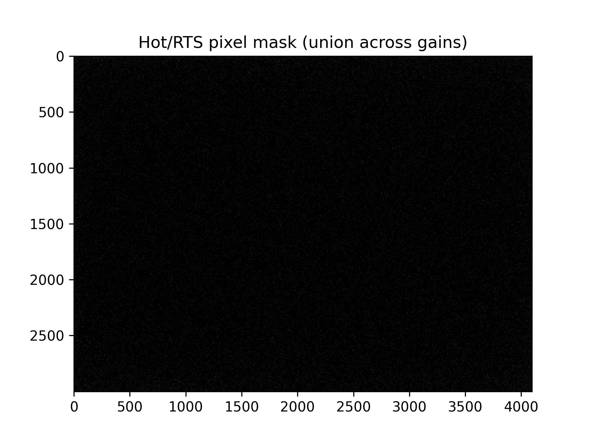
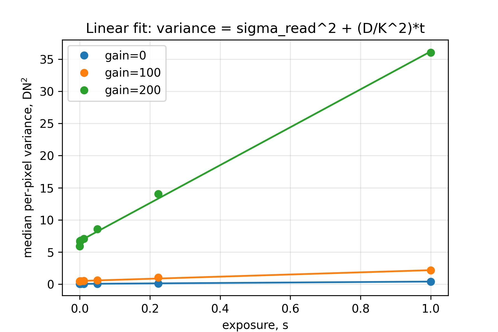
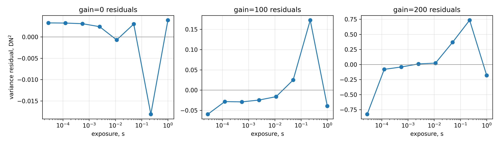
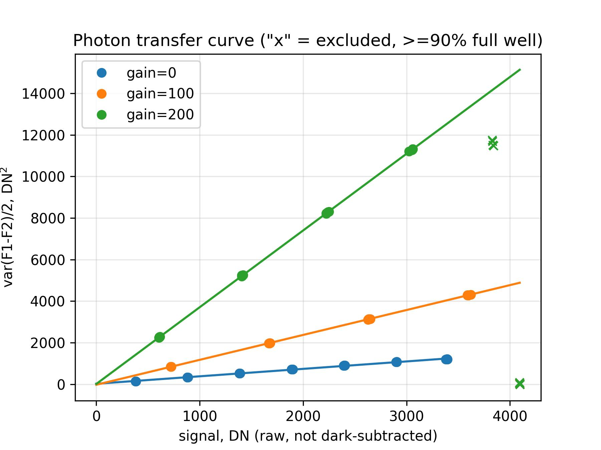
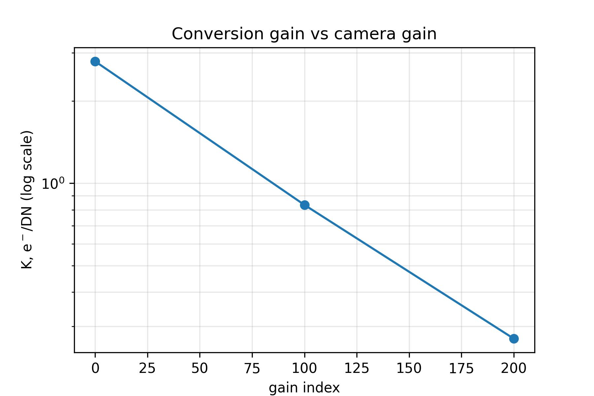
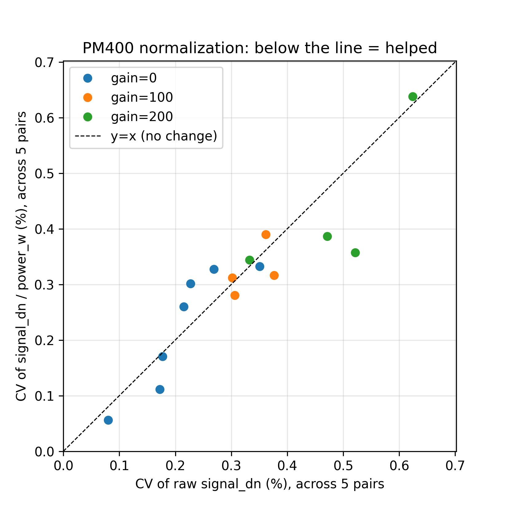

# Camera Noise Characterization

## Setup

To average the right number of frames for any exposure/gain/signal setting — instead of
re-characterizing noise every time a setting changes — we built a parametric noise model
for the ThorCam (serial `35596`):

```
sigma^2(t, g, I) = sigma_read^2(g) + D*t/K^2(g) + I/K(g) + (c_res*I)^2
```

`t` is exposure time, `g` the camera's internal gain index, `I` the signal level (DN).
`sigma_read(g)` (read noise), `D` (dark-current rate) and `K(g)` (conversion gain, e⁻/DN)
are one-time, camera-intrinsic sensor properties; `c_res` (residual illumination
fluctuation after power-meter normalization) is path-dependent and re-measured whenever the
illumination optics change.

Three acquisitions feed this model, all with the camera's central 20% ROI or full frame,
100 dark frames or 5 frame-pairs per point as noted:

| Dataset | Script | Purpose |
|---|---|---|
| Read-noise sweep | `scripts/test/thorcam_read_noise.py` | `sigma_read(g)`, DSNU/hot-pixel maps |
| Dark-current sweep | `scripts/test/thorcam_dark_current.py` | `D/K^2(g)`, `D/K(g)` |
| Photon-transfer curve (PTC) | `scripts/test/thorcam_ptc_gain.py` | `K(g)`, saturation/full well |

All figures and quoted numbers below are reproduced from
[`thorcam_noise_analysis.ipynb`](../data/20260709_Camera_noise/thorcam_noise_analysis.ipynb).
The residual-lamp term `c_res` is not yet measured for any illumination path and is called
out where it matters below.

## Read Noise vs Gain

Read noise was measured from 100 dark frames per gain at the camera's minimum exposure
(28 µs), across 8 gain settings spanning the camera's full range (0–250, an internal
dB-like index rather than calibrated dB).


**Figure 1.** Read noise (median per-pixel temporal std) vs gain index, log scale. Gray
"x" markers are below 1 DN and excluded from the fit as quantization-limited.

| Parameter | Value |
|---|---|
| Fit | `ln(RN) = -1.124 + 0.01063 * g` (fit to gains 140–250 only) |
| Gain law | 0.092 dB per gain-index step |
| Growth | 2.90x per 100 gain-index steps |
| Read noise range | 0.26 DN (g=0) -> 4.75 DN (g=250) |

Below about 1 DN (gains 0–60), the measured std is dominated by the ADC's own
quantization step rather than true analog read noise, so those points are excluded from
the fit — the true noise floor at low gain is smaller than plotted, just not resolvable
with this camera's bit depth. Above that floor, read noise grows exponentially with gain
at a rate equivalent to 0.092 dB/index, i.e. roughly a factor of 2.9 every 100 gain-index
steps. This dB/index law recurs almost identically in the conversion-gain measurement
below, because both are set by the same analog gain stage.

## Fixed-Pattern Noise and Hot/RTS Pixels

The same dark-frame stacks also give a per-pixel offset map (DSNU) and per-pixel temporal
std map, at every gain.


**Figure 2.** Mean frame (DSNU, left) and per-pixel temporal std (right) at gain 250,
1st–99th percentile stretch.

A small population of pixels sits far above the median in both maps, and — critically —
the *same* pixels: mean offset and temporal std are correlated (r ≈ 0.72 at gain 250),
and the flagged locations are largely stable across gain (59% of pixels hot at gain 0 are
still hot at gain 250). That combination — elevated both in fixed level and in
run-to-run variability, present already at minimum gain and exposure — rules out stray
light leaking through the capped lens (which would need exposure time to accumulate) and
instead points to ordinary sensor-intrinsic hot/telegraph-noise (RTS) pixels, amplified
like everything else by the analog gain stage.

| Gain | Flagged fraction | Flagged pixels |
|---|---|---|
| 0 | 0.405% | 49,731 |
| 30 | 0.568% | 69,823 |
| 60 | 0.599% | 73,641 |
| 100 | 0.662% | 81,295 |
| 140 | 0.625% | 76,843 |
| 180 | 0.664% | 81,554 |
| 220 | 0.678% | 83,347 |
| 250 | 0.688% | 84,542 |
| **Union (any gain)** | **0.973%** | **119,596** |


**Figure 3.** Union hot/RTS pixel mask across all 8 gains (white = flagged), built with a
robust median+10·MAD threshold on the temporal std map.

This matters beyond simple imaging. The phase-imaging pipeline divides a sample stack by
a reference stack, `C = C^(s)/C^(r)`, then takes the phase. A purely *fixed* per-pixel
offset (DSNU) cancels in that division — it's the same additive term in both stacks.
Telegraph-noise and hot pixels don't get that cancellation: by definition they take on a
*different* value on each acquisition, so the value baked into `C^(s)` generally isn't the
value baked into `C^(r)`. At those coordinates the division leaves a residual phase error
that does not average away with more frames the way ordinary read/shot noise does — masking
those pixels (not averaging through them) is the only fix. A ready-to-use mask
(`hot_pixel_mask.npy`, ~1% of pixels) and an `apply_hot_pixel_mask()` helper are built in
the notebook for this purpose.

## Dark Current

With the lens capped, the model reduces to `sigma^2(t,g) = sigma_read^2(g) + (D/K^2(g))*t`:
per-pixel temporal variance should grow linearly with exposure, sampled here from 28 µs to
1 s at three gains (0, 100, 200).


**Figure 4.** Median per-pixel dark variance vs exposure, log-x, with the linear fit
overlaid per gain.

| Gain | Slope, `D/K^2(g)` (DN²/s) | Intercept (DN²) | -> RN (DN) | RN sweep (DN) | diff |
|---|---|---|---|---|---|
| 0 | 0.357 | 0.054 | 0.233 | 0.256 | -9.1% |
| 100 | 1.672 | 0.510 | 0.714 | 0.704 | +1.5% |
| 200 | 29.457 | 6.726 | 2.593 | 2.721 (interp.) | -4.7% |

The fit intercept — read noise implied purely by the dark-current sweep, with no
reference to the read-noise sweep at all — matches the directly-measured read noise to
within about 5–9%, a solid independent cross-check that both measurements are self-consistent.

| Gain | `sigma_read^2` (DN²) | `dark_var_rate` (DN²/s) | Crossover exposure |
|---|---|---|---|
| 0 | 0.054 | 0.357 | 0.15 s |
| 100 | 0.510 | 1.672 | 0.31 s |
| 200 | 6.726 | 29.457 | 0.23 s |

Dividing the intercept by the slope gives the exposure at which dark-current variance
overtakes read-noise variance: **roughly 0.15–0.31 s across all three gains**. Below that,
read noise sets the noise floor; above it, dark current takes over and should be
dark-subtracted or included via the model rather than ignored.


**Figure 5.** Residuals of the linear variance-vs-exposure fit, per gain, log-x.

The residuals are not flat: refitting with the longest exposure (1 s) excluded shifts the
fitted slope by −26% (g=0), +56% (g=100), and +15% (g=200) — real curvature, not fit
noise. This is consistent with either hot-pixel dark current growing faster than linearly
at long integration, or slow temperature drift over the length of the sweep, and means the
single linear `D/K^2(g)` rate quoted above is most reliable well under 1 s and should be
treated as approximate near it.

## Conversion Gain K(g) — Photon Transfer

Conversion gain converts DN to electrons and is the one quantity that needed actual light:
a photon-transfer sweep (two-frame difference method) at 7 signal levels x 5 pairs per
gain, with points at or above 90% of full well excluded from the fit (nonlinearity near
saturation).


**Figure 6.** `var(F1−F2)/2` vs mean signal, per gain; "x" markers are excluded
(≥90% full well); solid lines are the fitted `variance = intercept + signal/K`.

| Gain | K (e⁻/DN) | PTC intercept (DN²) | PTC-implied RN (DN) |
|---|---|---|---|
| 0 | 2.790 | 20.93 | 4.58 (diagnostic only) |
| 100 | 0.834 | −27.10 | 0.00 (diagnostic only) |
| 200 | 0.271 | 11.16 | 3.34 (diagnostic only) |

The fit *slope* (giving K) is robust — refitting the raw data reproduces it exactly. The
*intercept* is not: it's a long extrapolation back to zero signal from the sampled range
(380–3400 DN), and one gain even produces a negative value. The read-noise sweep's direct
dark measurement (Section "Read Noise vs Gain") remains the authoritative read-noise value;
the PTC intercept is reported here only as a diagnostic, not used anywhere in the model.


**Figure 7.** K(g), log scale, across the 3 measured gains.

K falls off exponentially with gain — 3.35x from g=0 to g=100, 3.08x from g=100 to g=200,
i.e. ~3.2x per 100 gain-index steps — echoing the read-noise-vs-gain law from Section 1
(2.9x per 100 index) almost exactly, because both are set by the same analog gain stage.

With K(g) in hand, both earlier dark measurements can be referred to electrons — the
gain-independence check that wasn't possible before K existed:

| Gain | Read noise (DN) | K (e⁻/DN) | Read noise (e⁻) |
|---|---|---|---|
| 0 | 0.325 | 2.790 | 0.907 (quantization-limited, ignore) |
| 100 | 0.941 | 0.834 | 0.785 |
| 200 | 2.723 | 0.271 | 0.737 |

| Gain | `D/K` (DN/s) | K (e⁻/DN) | D (e⁻/s) |
|---|---|---|---|
| 0 | 0.420 | 2.790 | 1.171 |
| 100 | 0.796 | 0.834 | 0.664 |
| 200 | 4.083 | 0.271 | 1.105 |

Both read noise and dark-current rate come out roughly **gain-independent** once
expressed in electrons (~0.74–0.91 e⁻ read noise; ~0.66–1.17 e⁻/s dark current) — exactly
what a well-behaved sensor should show, since both are physical properties of the pixel,
not of the analog gain applied afterward. This confirms the model's `D*t/K^2(g)` and
`sigma_read^2(g)` forms are doing the right thing.

As a side effect, this also explains why Section 2's rough dark-shot-noise sanity estimate
of K undershot the truth by a factor of ~1.75–2.37x: that estimate used raw dark-frame
variance, which the hot/RTS-pixel population (previous section) inflates. The PTC's
central-ROI, frame-difference method is immune to that inflation, so the K values here are
the ones to trust.

Finally, the same PTC sweep shows the signal plateau at the ADC's maximum code (4095)
at every gain — saturation in DN is therefore gain-independent, but the corresponding
full-well capacity in electrons shrinks with gain because a smaller K divides the same
electron well into DN more coarsely:

| Gain | Saturation (DN) | Full well (e⁻) | Dynamic range |
|---|---|---|---|
| 0 | 4095 | 11,426 | 12,600 |
| 100 | 4095 | 3,415 | 4,353 |
| 200 | 4095 | 1,108 | 1,504 |

(This is the ADC-clip point, an upper bound implied by `pixel_max / K(g)` — not necessarily
the pixel's true physical well capacity.)

### Does PM400 normalization actually help?

The PTC sweep recorded a PM400 power reading (`power_w`) bracketing every one of its 5
repeat pairs per signal level — data that wasn't needed for `K(g)` (the two-frame
difference method is self-calibrating) but doubles as a first, informal test of whether
normalizing the camera signal by the power meter reading reduces pair-to-pair scatter,
ahead of the dedicated test Section 4c will need.


**Figure 8.** Coefficient of variation (CV) of raw `signal_dn` vs CV of `signal_dn /
power_w`, across the 5 repeat pairs per (gain, level); points below the dashed `y=x` line
are cases where normalizing helped. Saturated levels (≥90% full well) excluded.

| Quantity | Value |
|---|---|
| Unsaturated (gain, level) points | 15 / 21 |
| Median `CV_raw / CV_norm` | 1.04 |
| Points where normalization helped (ratio > 1) | 53% |

**The result is inconclusive, not positive.** Normalizing helps about half the time and,
by similar margins, hurts the other half — a median improvement of only 4%, indistinguishable
from no effect given the scatter. Two likely reasons: only 5 pairs per point, so a single
outlier pair swings the ratio substantially; and `power_w` is the average of readings taken
*before and after* each pair rather than sampled synchronously with the exposure, so it may
not track the illumination during the actual frame closely enough to cancel it. This is a
useful negative result for planning Section 4c: that acquisition should sample power
synchronously with each frame (or at least with a much tighter bracket) and take many more
than 5 repeats before concluding whether normalization earns its keep.

## Practical Implications for Future Measurements

- **Gain choice is a dynamic-range trade, not a noise-reduction trade.** The
  electron-referred noise floor is essentially flat across gain (~0.8 e⁻); raising gain
  doesn't make the sensor quieter, it just spends full well and dynamic range (12,600 down
  to 1,504 across the measured range) to make each electron occupy more DN. Only reach for
  higher gain when the *signal itself* is weak enough to sit near the quantization floor in
  DN — not as a general noise-reduction lever.
- **Dark current is negligible for short exposures, not for long ones.** Below roughly
  0.15–0.31 s (crossover exposure, all three gains), read noise dominates and dark current
  can be safely ignored. Past that, dark current takes over and should be subtracted or
  included via `dark_var_rate(g)`/`dark_signal_rate(g)` — and treat the rate itself as
  approximate above ~1 s, where real curvature (likely hot-pixel or thermal-drift related)
  was measured.
- **Mask hot/RTS pixels before dividing, not after.** ~1% of the array doesn't cancel in
  `C^(s)/C^(r)` the way ordinary offset does. `hot_pixel_mask.npy` and
  `apply_hot_pixel_mask()` are ready to use — apply them to sample and reference frames (or
  to the resulting phase map) before any downstream fitting or averaging.
- **The required-N calculator works end to end now, except for `c_res`.** With `K(g)`
  measured, `sigma2_model(t, g, I, K, c_res)` and `required_N(t, g, I, sigma_target, c_res)`
  run without needing a manual override — but `c_res=0` (i.e. assuming a perfectly stable,
  already-normalized illumination source) is still an *assumption*, not a measurement. Worked
  example from the notebook: at `t=10 ms`, `g=100`, `I=500 DN`, targeting `sigma=1 DN`,
  `c_res=0` gives **N=601 frames** — large because at that signal level shot noise
  (`I/K`) dominates the budget, not because anything is wrong. Until `c_res` is measured for
  the actual illumination path in use, every `required_N` estimate with `I>0` is a **lower
  bound**: the true residual-lamp term can only add to it.
- **Don't assume PM400 normalization helps without checking.** The informal test above
  found no consistent benefit from dividing by `power_w` (53% of points improved, 47%
  got worse, median change ~4%) — likely because the power reading wasn't synchronous
  with the exposure and only 5 repeats were available. Section 4c's acquisition should
  fix both before `c_res` is trusted as a real reduction from normalization rather than
  just relabeling the same fluctuation.

## Results

- **Read noise:** 0.26–4.75 DN across the gain range, growing exponentially at 0.092
  dB/index (2.9x/100 index); sub-1-DN points at low gain are quantization-limited, not a
  true noise measurement.
- **Hot/RTS pixels:** ~0.4–0.7% of the array per gain, 0.97% in union, driven by
  sensor-intrinsic defects (not light leak) — and a real risk for `C^(s)/C^(r)` phase
  imaging since these pixels don't cancel in the ratio. A mask and helper function are
  ready to use.
- **Dark current:** cross-checks against the read-noise sweep agree within 5–9%; read noise
  dominates below ~0.15–0.31 s exposure, dark current above it; measurable curvature near
  1 s means the linear rate is approximate at long exposure.
- **Conversion gain:** K = [2.790, 0.834, 0.271] e⁻/DN at gains [0, 100, 200], falling
  ~3.2x/100 gain-index steps — the same law as read noise. Read noise (~0.74–0.91 e⁻) and
  dark current (~0.66–1.17 e⁻/s) are both roughly gain-independent once referred to
  electrons, as expected for a well-behaved sensor.
- **Saturation / full well:** ADC clips at 4095 DN at every gain; full well shrinks from
  11,426 e⁻ (g=0) to 1,108 e⁻ (g=200), and dynamic range from 12,600 to 1,504 accordingly.
- **PM400 normalization:** an informal check using the PTC's incidental power-meter
  readings found no consistent stability benefit from normalizing (53%/47% split,
  ~4% median change) — likely a small-sample and timing-synchronization artifact rather
  than evidence normalization doesn't work; Section 4c's dedicated acquisition needs
  synchronous power sampling and more repeats to settle this properly.
- **Still missing:** `c_res` (residual illumination fluctuation after power-meter
  normalization), which is path-dependent and must be re-measured for the actual
  illumination setup before `required_N` estimates are final rather than lower bounds.
