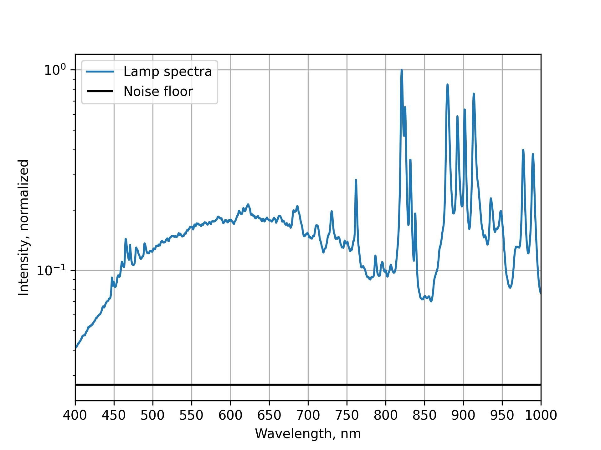
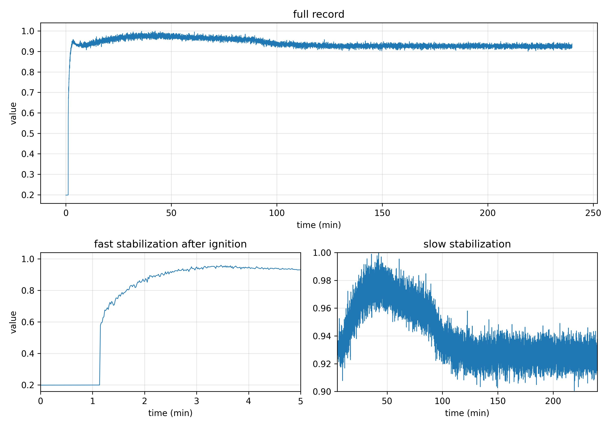
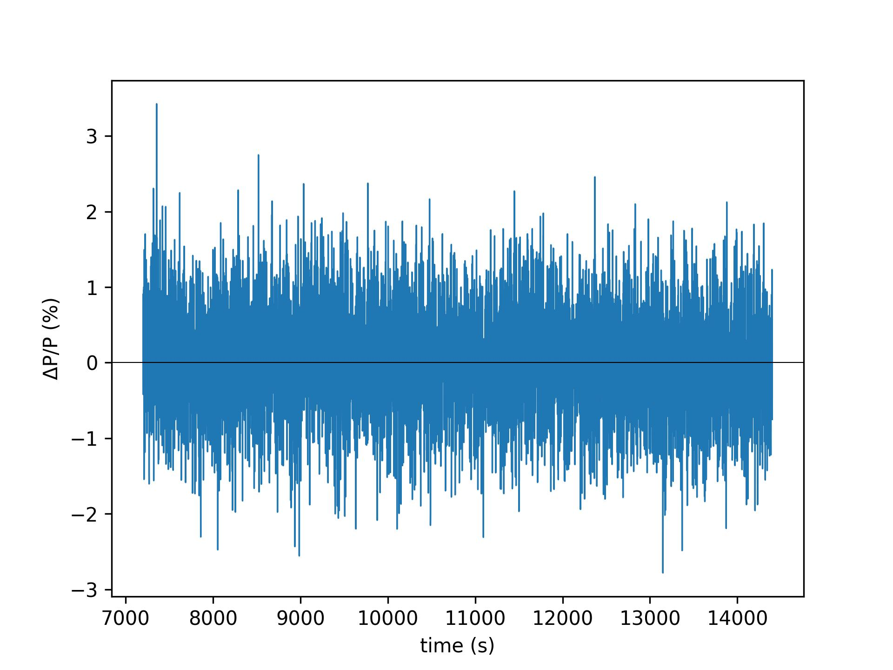
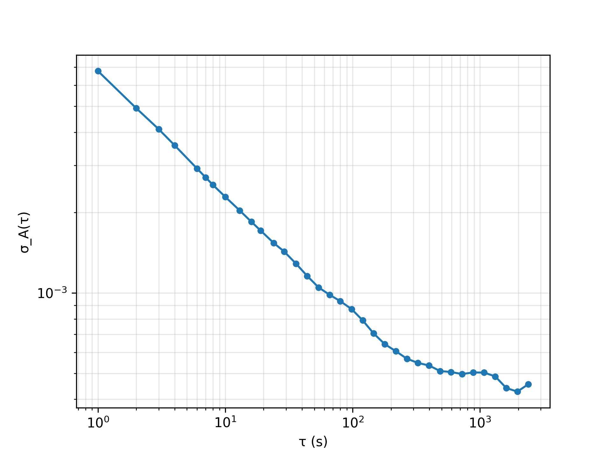
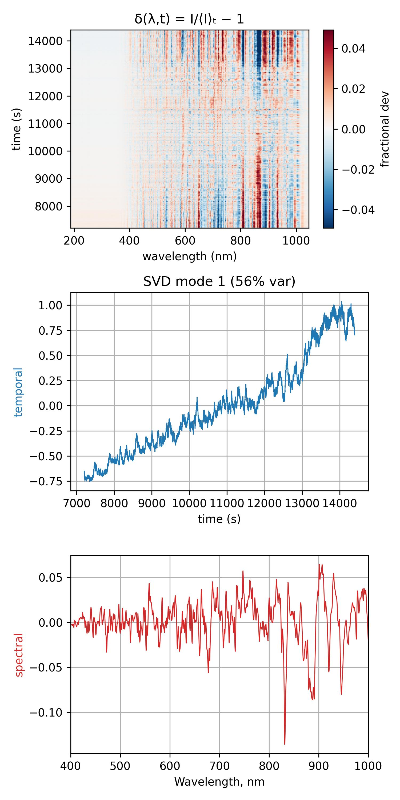
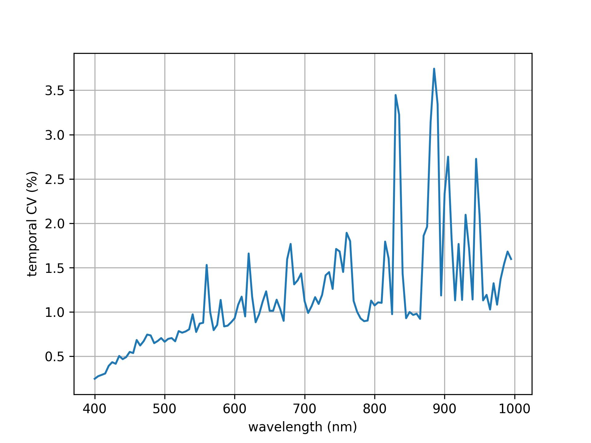
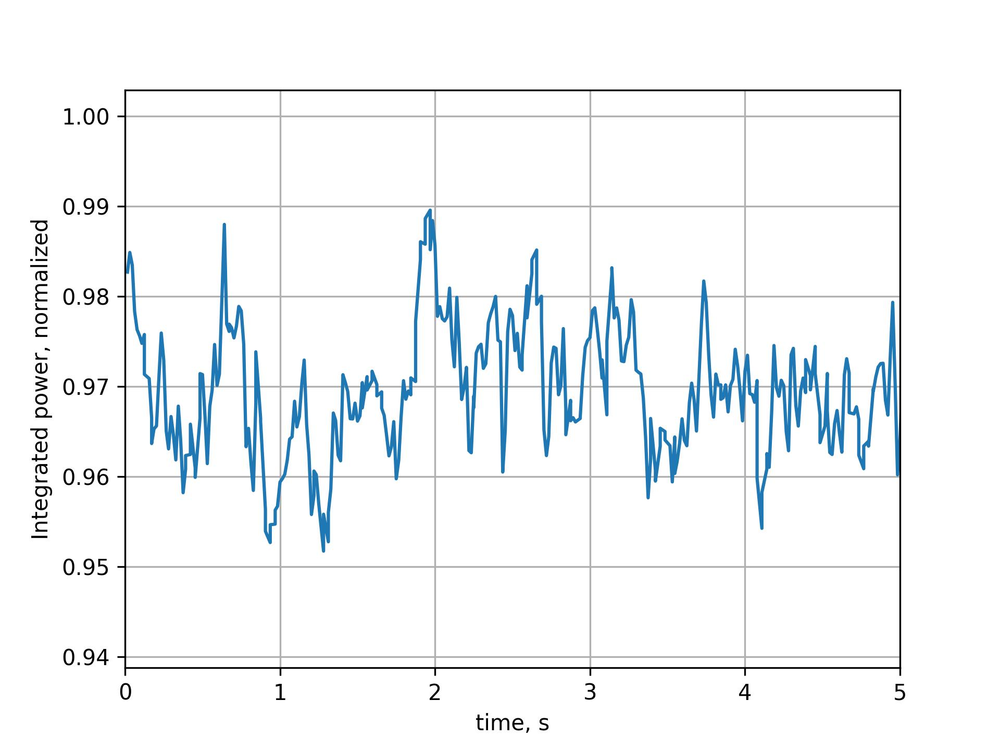
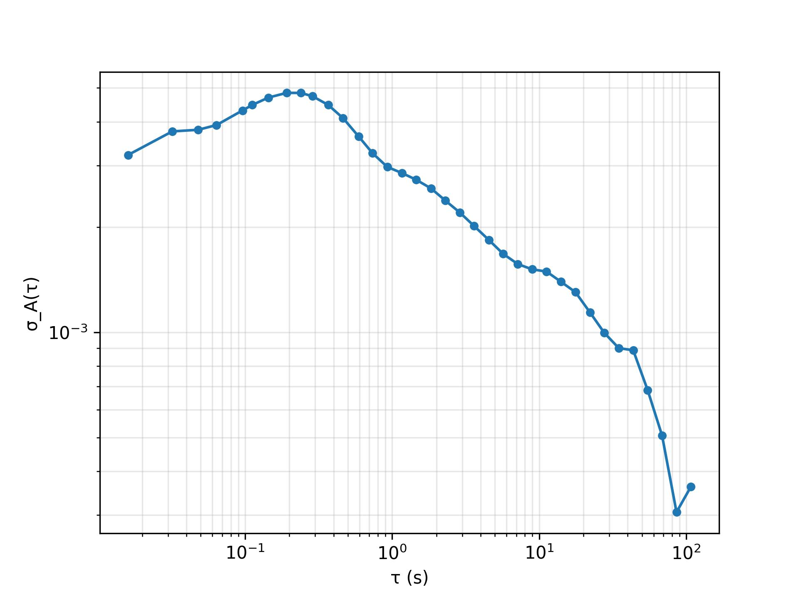

# Lamp Stability Measurements

## Setup

To understand how long the monochromator's lamp takes to warm up, and how
much its output fluctuates once it has settled, we recorded the lamp spectrum
over time in two regimes: a **long-term** run (4 hours, 1 s cadence, 10 scans
averaged per sample) capturing warm-up and steady-state drift, and a **fast**
run (5 minutes, ~67 Hz, unaveraged) intended to resolve fluctuations on
sub-second timescales that the long-term run's averaging would hide. The lamp is a 300 W Xenon source in
a Newport monochromator; spectra were acquired with an Ocean Insight OCEANSR6
spectrometer (s/n SR600410) with the VIS grating positioned at the lamp
baseline. All figures and quoted numbers below are reproduced from
[`lamp_stability.ipynb`](../data/20260707_Lamp_stability_test/lamp_stability.ipynb).

## Lamp Spectrum

Figure 1 shows the lamp's steady-state spectrum, normalized to its peak
intensity, together with the spectrometer's noise floor (mean signal over the
first 300 samples of the dark/baseline region).


**Figure 1.** Normalized steady-state lamp spectrum (blue) versus spectrometer
noise floor (black), 400–1000 nm, log intensity scale.

The spectrum is dominated by the broad Xenon continuum, several nanometers
above the noise floor across the full visible-to-NIR window, with the
characteristic Xe emission lines superimposed near 800–1000 nm.

## Long-Term Measurement

To characterize lamp warm-up and long-term drift, we recorded one spectrum
per second for 4 hours starting at ignition, averaging 10 scans per
recorded sample at a fixed integration time (set once by autoexposure before
the run).

| Parameter | Value |
|---|---|
| Elapsed time | 14400 s (4 hours) |
| Time step per measurement | 1.0 s |
| Integration time | 10.23 ms |
| Scans averaged per sample | 10 |
| Spectra array shape | (14400, 2048) |

### Warm-up and integrated power

For each time step, the spectrum was integrated over wavelength (trapezoidal
rule) to obtain a single broadband power value `P(t)`.


**Figure 2.** Integrated lamp power, normalized to its maximum, over the full
4-hour run. Top: full record. Bottom-left: ignition zoom (0–5 min) showing the
fast ignition transient. Bottom-right: zoom of the slower warm-up and its
settling to steady state (5 min to end of run, note the restricted y-range).

The trace shows a fast ignition transient over roughly the first 2 minutes,
in which the lamp reaches ~90% of its eventual level. This is followed by a
slower thermal **overshoot**, peaking around 40–50 minutes after ignition at
a level a few percent above the eventual steady state, and then a gradual
decay as the lamp continues to warm mechanically. The output does not settle
onto a flat plateau until roughly **110–120 minutes** after ignition (because
the plotted power is normalized to its maximum, which occurs during the
overshoot, the steady-state plateau sits visibly below 1.0 in Figure 2). The
lamp should therefore not be treated as a stable reference source until
**~2 hours** after ignition, not simply after the initial transient has
decayed.

### Steady-state stability

Restricting to the settled tail of the run (`t ≥ 7200` s, i.e. the last
2 hours) isolates steady-state fluctuations from the warm-up transient.

| Quantity | Value |
|---|---|
| Mean integrated power, `P̄` | 4.271e+06 (counts·nm) |
| Fractional RMS, `σ_P / P̄` | 6.984e-03 |
| Peak-to-peak fractional deviation | 6.204e-02 |


**Figure 3.** Fractional deviation of integrated power, `ΔP/P` (%),
about its steady-state mean, for `t ≥ 7200` s.

Once warmed up, the lamp's broadband output is stable to within ~0.7% RMS,
with occasional excursions up to ~6% peak-to-peak — consistent with slow
residual drift rather than random shot-to-shot noise.

### Allan deviation

The overlapping Allan deviation, `σ_A(τ)`, quantifies how the
stability of the integrated power depends on the averaging (or reference)
time `τ` used when comparing two measurements. It is computed by taking
second differences of the cumulative sum of the fractional power deviation
at spacing `m` samples, for a range of `m`, and forms the standard tool
for separating noise sources that average down (white noise, whose
`σ_A(τ)` falls as `τ^(-1/2)`) from slower drifts that
eventually dominate and cause `σ_A(τ)` to rise again at large
`τ`. The minimum of the curve therefore identifies the optimal
averaging/reference time: the point beyond which further averaging no longer
improves stability because drift has taken over from noise.


**Figure 4.** Overlapping Allan deviation of the fractional integrated power
in steady state, versus averaging time `τ`.

The curve falls off as white noise (`σ_A(τ) ∝ τ^(-1/2)`) from `τ = 1` s out
to several hundred seconds, then its slope gradually shallows and it
**saturates toward the end of the 2-hour steady-state window**, reaching its
lowest value, `σ_A = 4.275e-04` (~0.04%), at `τ = 1965` s — comparable to the
length of the segment itself. There is no true drift-driven upturn within
this record: the slight uptick at the very last point reflects the small
number of independent estimates available at that τ (an edge/statistics
effect), not the lamp's power actually becoming less stable at long
averaging times. In other words, over the 2-hour steady-state window probed
here, slow drift never dominates over noise — averaging or re-referencing
keeps paying off essentially all the way out to the length of the run.

### Reference timing: how fast must the second measurement follow the first?

This curve is also the direct input for the timing budget of a
sample/reference measurement pair. When a sample spectrum `C⁽ˢ⁾` and a
reference spectrum `C⁽ʳ⁾` are acquired separated by a gap `Δt` and then
divided, the ratio's error is set by how much the lamp happens to drift
between the two acquisitions. Because the two acquisitions are effectively
independent draws from the same underlying fluctuation, the uncorrelated
error introduced into the ratio is

```
σ_pair(Δt) ≈ √2 · σ_A(Δt)
```

i.e. the Allan deviation evaluated at `τ = Δt`, scaled by `√2` for the two
independent measurements being differenced. This turns Figure 4 into a
lookup table: pick the ratio-error budget you can tolerate, solve for the
required `σ_A(Δt) < budget / √2`, and read the corresponding `Δt` off the
curve — that is the maximum tolerable sample↔reference gap.

Concretely, for this lamp: a 0.2% budget on the ratio requires
`σ_A(Δt) ≲ 1.4e-3`, which the curve reaches within the first few tens of
seconds; tightening the budget to 0.1% requires `σ_A(Δt) ≲ 7e-4`, pushing the
allowed gap out to order 100–200 s. The best achievable pair precision, using
the curve's floor of `4.275e-4` near `τ ≈ 1965` s, is `√2 × 4.275e-4 ≈
6e-4` (~0.06%) — but in practice a `Δt` of tens of seconds is the more useful
operating point, since it already meets a sub-0.2% budget without forcing an
impractically long gap between sample and reference acquisitions. The
tighter the error budget, the sooner the reference must be re-acquired
relative to the sample.

### Amplitude-vs-shape decomposition

Steady-state drift can change the lamp output in two qualitatively different
ways: a uniform brightness change across all wavelengths ("amplitude"
drift), or a change in the relative shape of the spectrum ("shape" drift,
e.g. color temperature shift). To separate these, we compute the
fractional-deviation matrix

```
δ(λ, t) = I(λ, t) / ⟨I(λ)⟩_t − 1
```

decompose it into a broadband amplitude term `a(t) = ⟨δ(λ,t)⟩_λ`
(the mean deviation at each time, common to all wavelengths) and a shape
residual `R(λ,t) = δ(λ,t) − a(t)`, and compare their variances. As a
cross-check, we also take the SVD of `δ(λ,t)`: a dominant mode with near-zero
spectral "flatness" (i.e. roughly constant across `λ`) indicates amplitude-like
drift, while a mode with high spectral flatness (strong wavelength
dependence) indicates shape-like drift.

| Quantity | Value |
|---|---|
| Amplitude variance | 3.164e-05  (16.5% of total) |
| Shape variance | 1.606e-04  (83.5% of total) |
| SVD mode-1 variance fraction | 0.56 |
| SVD mode-1 spectral flatness | 51.30 |


**Figure 5.** Top: fractional-deviation heatmap `δ(λ,t)`.
Middle: temporal profile of the dominant SVD mode. Bottom: spectral profile
of the dominant SVD mode.

Steady-state drift is dominated by **spectral-shape** changes (83.5% of the
variance) rather than uniform brightness changes (amplitude, 16.5%) — the
opposite of a simple overall dimming or brightening. The dominant SVD mode
alone accounts for 56% of the total variance and has a high spectral
flatness (51.30, far from the ≈0 expected for a pure amplitude mode),
confirming it is strongly wavelength-dependent. Its temporal profile
(Figure 5, middle) is a slow, mostly monotonic ramp across the 2-hour tail
rather than stationary noise, and its spectral profile (Figure 5, bottom) is
largest in the red and NIR and peaks sharply near the Xe emission lines
(800–1000 nm). Physically this points to a slow color-temperature drift
(e.g. residual thermal drift of the lamp/monochromator after the ~2-hour
warm-up) rather than a simple change in total output — consistent with the
per-band noise pattern below.

### Per-band noise

To see how the temporal noise found above is distributed across the
spectrum, the steady-state spectra were projected onto a bank of Gaussian
passbands (5 nm FWHM, spaced every 5 nm from 400–1000 nm), and the temporal
coefficient of variation (CV, i.e. fractional std. dev. over the 2-hour tail)
was computed for each band.


**Figure 6.** Temporal coefficient of variation, per 5-nm band, versus band
center wavelength, over the steady-state tail (`t ≥ 7200` s).

The temporal CV rises steadily from ~0.25% in the blue (400 nm) to ~1–2% in
the red (600–800 nm), with sharp spikes reaching 2–3.7% at the Xe emission
lines (800–1000 nm). This is consistent with the amplitude/shape
decomposition above: the blue continuum, where the dominant (shape-like)
drift mode has the least spectral weight, is the most stable region of the
spectrum, while the red/NIR continuum and the discrete Xe lines — where that
mode has the most weight — carry most of the drift and noise.

## Fast-Scale Measurement

In addition to the long-term run above, we acquired a 5-minute, unaveraged
run at the spectrometer's maximum sampling rate to resolve fluctuations that
the 10-scan averaging of the long-term run would smooth out. The
monochromator (VIS grating, lamp baseline) and integration time (set once by
autoexposure targeting 0.5 fill fraction before the run) were otherwise
unchanged.

| Parameter | Value |
|---|---|
| Elapsed time | 300 s (5 min) |
| Integration time | 7.2 ms |
| Scans averaged per sample | 1 (none) |
| Time step per measurement | 14.85 ms (~67 Hz) |
| Spectra array shape | (20207, 2048) |

Source data:
[`lamp_stability_spectral_fast_20260707_154730.npz`](../data/20260707_Lamp_stability_test/lamp_stability_spectral_fast_20260707_154730.npz).

| Quantity | Value |
|---|---|
| Mean integrated power, `P̄` | 3.419e+06 (counts·nm) |
| Fractional RMS, `σ_P / P̄` | 7.875e-03 |
| Peak-to-peak fractional deviation | 6.015e-02 |


**Figure 7.** Integrated power, normalized to its maximum, over a 5-second
window of the fast run.

At sub-second cadence the lamp shows ~0.8% RMS flicker (comparable to the
~0.7% RMS seen in the long-term steady-state run), confirming that most of
the broadband fluctuation budget is already present on millisecond
timescales rather than being an artifact of slower drift.


**Figure 8.** Overlapping Allan deviation of the fractional integrated power
for the fast run, versus averaging time `τ`.

The Allan deviation shows a small correlated-flicker bump below `τ ≈ 0.2` s,
then falls off as white noise (`σ_A(τ) ∝ τ^(-1/2)`) down to a minimum of
`σ_A = 3.057e-04` at `τ = 86` s, with only a slight uptick at the final,
statistics-limited point. Unlike the long-term run, this 5-minute record is
too short to probe whether a drift floor exists beyond `τ ≈ 100` s; within
the record, sub-second flicker averages down cleanly with no sign of a fixed
noise plateau.

## Results

- **Warm-up:** the lamp needs approximately **2 hours** after ignition to
  reach a stable steady-state output, and should not be used as a reference
  before then. Warm-up is non-monotonic: a fast rise over the first ~2
  minutes is followed by a thermal overshoot peaking around 40–50 minutes,
  which then decays to a flat plateau only by ~110–120 minutes.
- **Steady-state stability:** once warmed up, integrated power is stable to
  ~0.7% RMS (up to ~6% peak-to-peak), and this fluctuation is dominated by
  fast (sub-second) flicker rather than slow drift.
- **Allan deviation:** shows no drift-driven upturn within the 2-hour
  steady-state window — `σ_A(τ)` falls as white noise and only saturates
  near the end of the record, reaching `σ_A ≈ 4.3e-04` (~0.04%) at
  `τ ≈ 1965` s. Averaging or re-referencing therefore keeps helping across
  essentially the whole window.
- **Reference timing:** for a sample/reference power ratio, the pair error is
  `σ_pair(Δt) ≈ √2·σ_A(Δt)`; reading this off the Allan curve, a `Δt` of
  tens of seconds keeps the ratio error below ~0.2%, while ~100–200 s is
  needed to reach ~0.1%.
- **Amplitude vs. shape:** steady-state drift is dominated by
  **spectral-shape** changes (83.5% of variance) rather than uniform
  brightness changes (16.5%); the dominant drift mode is strongly
  wavelength-dependent (spectral flatness 51.3), consistent with a slow
  color-temperature drift concentrated in the red/NIR and at the Xe emission
  lines.
- **Per-band noise:** temporal noise is smallest in the blue (~0.25% CV at
  400 nm) and rises to ~1–2% in the red, with 2–3.7% spikes at the Xe
  emission lines (800–1000 nm).
- **Fast-timescale stability:** sub-second flicker is ~0.8% RMS and averages
  down as white noise to `σ_A ≈ 3.1e-04` by `τ ≈ 86` s, with no sign of a
  fast-noise floor within the 5-minute fast run.
