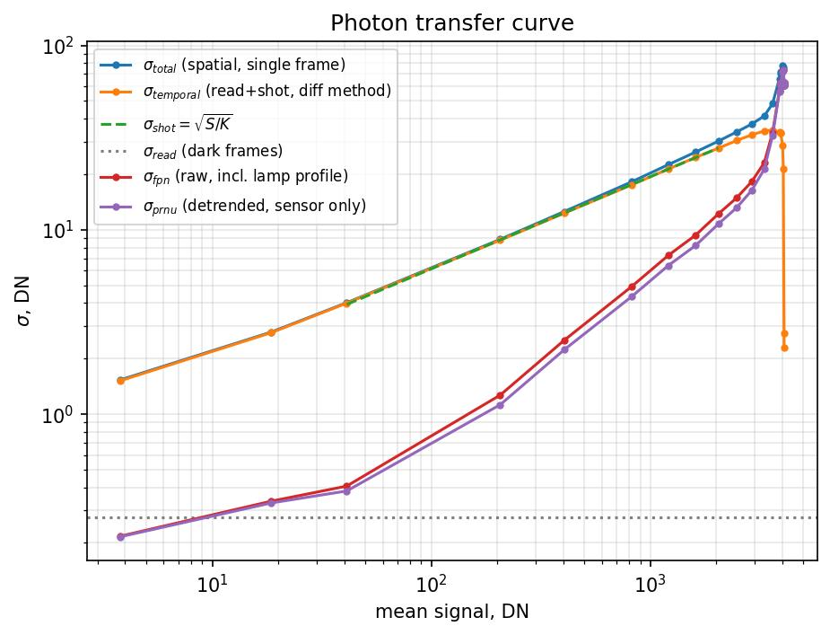
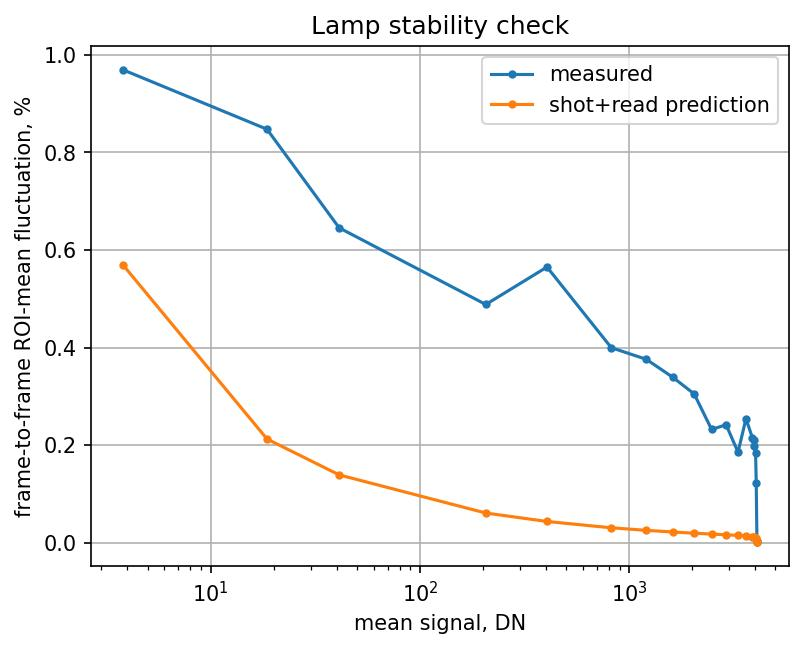

# Photon Transfer Curve — ThorCam Noise Decomposition

## Setup

Following the two-frame-difference method from Janesick's *Photon Transfer* (SPIE), we
recorded bright/dark frame stacks across 20 illumination levels spanning 0.1%–99.9% of
full well, at fixed gain (index 0), with the ThorCam (serial `35596`). For each level:
50 bright frames (filter wheel open) and 50 dark frames (filter wheel closed,
back-to-back), both cropped to the central 70×70 px sub-ROI (verified vignetting-free).
Exposure at each level was set by autoexposure. Acquisition:
[`scripts/test/thorcam_noise_bright.py`](../scripts/test/thorcam_noise_bright.py).
All figures and numbers below are reproduced from
[`thorcam_noise_analysis.ipynb`](../data/20260709_Camera_noise/thorcam_noise_analysis.ipynb).

| Parameter | Value |
|---|---|
| Gain index | 0 |
| Signal levels | 20 (0.1%–99.9% of full well) |
| Frames per level | 50 (bright), 50 (dark) |
| ROI | central 70×70 px |
| ADC full-scale (`pixel_max`) | 4095 DN |
| Dark subtraction | master dark (mean of 50 dark frames per level) |

## Noise Model

Total pixel noise decomposes into three independent terms (Janesick, Ch. 4):

```
sigma_total^2 = sigma_read^2 + sigma_shot^2 + sigma_fpn^2
```

- **`sigma_read`** — read noise, DN, signal-independent (flat floor).
- **`sigma_shot = sqrt(S / K)`** — photon shot noise, DN, where `S` is mean signal (DN)
  and `K` is the conversion gain (e⁻/DN). Slope-½ on a log-log plot.
- **`sigma_fpn = P_N * S`** — fixed-pattern noise, proportional to signal
  (`P_N` = PRNU factor). Slope-1, dominates near full well.

`sigma_shot` and `sigma_fpn` are both signal-dependent but statistically independent (one
temporal/random, one fixed/spatial), so they don't separate in a single frame's spatial
std. The standard trick is the **two-frame difference method**: for a pair of frames
`F1, F2` at identical illumination,

```
D = F1 - F2
sigma_temporal^2 = var(D) / 2   (= sigma_read^2 + sigma_shot^2)
```

Differencing cancels any *fixed* pattern (it's identical in both frames), and
mean-subtracting `D` before taking its variance additionally cancels any *common-mode*
fluctuation shared by every pixel — including global lamp flicker between the two frames.
`sigma_fpn` is then recovered by quadrature subtraction from the single-frame spatial std,
`sigma_total`:

```
sigma_fpn = sqrt(max(sigma_total^2 - sigma_temporal^2, 0))
```

## Conversion Gain and Read Noise

`K` is fit from `sigma_temporal^2 = sigma_read_var + S/K`, restricted to the **linear shot
region** (1%–60% of full well, `S` from ~40 to ~2460 DN). Above ~60% of full well, `var/S`
rolls off as the sensor approaches saturation — including that tail biases the fit, so it
is excluded (visible in the raw ratio: flat at ≈0.376 DN²/DN from 40–2460 DN, then falling
toward 0 above 4000 DN as the pixel saturates).

Read noise is measured **directly** from the dark-frame stacks (same difference method,
applied to `dark_dn`), not extrapolated from the PTC intercept — the intercept from a
linear fit through a signal range that starts at ~40 DN is a long, noisy extrapolation
back to zero and is reported only as a diagnostic.


**Figure 1.** Full noise decomposition: σ_total (spatial), σ_temporal (difference
method), σ_shot (fit), σ_read (dark-frame floor), σ_fpn (raw, quadrature), σ_prnu
(detrended, quadrature). Log-log.

| Quantity | Value | Source |
|---|---|---|
| Conversion gain, `K` | 2.660 e⁻/DN | this fit (linear region) |
| Conversion gain, `K` (cross-check) | 2.790 e⁻/DN | `thorcam_ptc_gain.py`, dedicated PTC sweep |
| Read noise (direct) | 0.275 DN (0.73 e⁻) | dark-frame difference, this dataset |
| Read noise (cross-check) | 0.256 DN | `thorcam_read_noise.py`, dedicated sweep |
| Read noise (PTC intercept, diagnostic) | ≈0.00 DN | quadrature fit intercept, not used |
| Full well (`pixel_max * K`) | ≈10,900 e⁻ | ADC-clip upper bound |
| Dynamic range (`pixel_max / read noise`) | ≈16,000:1 (~84 dB) | quantization-limited |

`K` agrees with the dedicated PTC measurement to ~5%; read noise agrees with the dedicated
read-noise sweep to ~7% — both within expected run-to-run variation for this ROI/lighting
setup, confirming the fit is well-conditioned once restricted to the linear region.

## Fixed-Pattern Noise: Raw vs. Detrended

The raw `sigma_fpn` includes not just sensor PRNU but also the lamp's own spatial
illumination profile across the 70×70 ROI (a smooth gradient, not a sensor property). To
isolate true pixel-to-pixel PRNU, a low-order 2D polynomial (the smooth illumination
shape, fit per level from the mean image) is subtracted before recomputing the spatial
std, giving `sigma_prnu`.

| Quantity | Value |
|---|---|
| PRNU factor, `P_N` (detrended, sensor-only) | ≈0.53% of signal |
| Raw FPN factor (includes lamp profile) | ≈0.60% of signal |

Detrending only shaves off a modest fraction of the raw FPN — the lamp's spatial
non-uniformity across this ROI is small relative to the sensor's own PRNU, so the raw
curve is already a reasonable stand-in for PRNU except very close to full well, where the
lamp/vignetting gradient becomes more visible (Figure 1, upper right).

## Lamp Stability Check

To check whether the two-frame difference method needs to worry about *temporal* lamp
flicker (as opposed to the spatial non-uniformity above), the frame-to-frame fluctuation
of the ROI mean is compared to what shot+read noise alone would predict.


**Figure 2.** Measured frame-to-frame ROI-mean fluctuation (%) vs. the shot+read-noise
prediction, across signal levels.

The measured curve sits above the shot-noise prediction at every level, by a roughly
constant **~0.4% excess** at high signal (and more at very low signal, where the
percentage is dominated by the read floor). This is the lamp's temporal flicker. It does
not corrupt `sigma_temporal` in Figure 1, because mean-subtracting each difference image
(`D -= D.mean()`) removes exactly this common-mode fluctuation before the variance is
taken — the same technique already used in `thorcam_ptc_gain.py`. It would, however,
inflate a naive single-frame-based shot-noise estimate that didn't use the difference
method.

## Conclusions

- **Lamp noise is real but secondary**: ~0.4% temporal flicker (removed by mean-subtracting
  each difference pair) and a small spatial illumination gradient across the ROI (removed
  by polynomial detrending before computing PRNU).

**Derived constants (gain index 0, this camera, serial `35596`):**

| Constant | Value |
|---|---|
| Conversion gain, `K` | **2.66 e⁻/DN** (2.79 e⁻/DN dedicated PTC) |
| Read noise, `sigma_read` | **0.275 DN ≈ 0.73 e⁻** (0.256 DN dedicated sweep) |
| Full well | **≈10,900 e⁻** (`pixel_max × K`, ADC-clip bound) |
| Dynamic range | **≈16,000:1 (~84 dB)** |
| PRNU factor, `P_N` (sensor only) | **≈0.53%** of signal |
| Raw FPN factor (incl. lamp profile) | **≈0.60%** of signal |
| Lamp temporal instability (excess) | **≈0.2–0.4%** frame-to-frame at high signal |

## Fast Error Estimation

Practical estimators with the constants above already plugged in, for quickly checking
"is this measurement good enough" without re-deriving anything. `S` is mean signal in DN,
`N` is the number of frames averaged.

### Per-pixel intensity, single ROI

```
eps_int(S, N) [%] = 100 * sqrt( (0.076 + 0.376*S)/N + (0.0053*S)^2 ) / S
```

- `0.076 = sigma_read^2`, `0.376 = 1/K` (DN²/DN, shot term), `0.0053 = P_N` (PRNU).
- Shot-limited quick form (valid above ~20 DN, single frame): `eps_int ≈ 61/sqrt(S)  %`.
- **Averaging floor:** the `0.0053*S` (PRNU) term does not shrink with `N` — it's a fixed
  per-pixel gain error, not noise. Beyond a few hundred frames, per-pixel intensity error
  stalls at **≈0.53%**, no matter how long you average. Only flat-fielding / referencing
  removes it (next section).

### Transmission ratio (the metasurface case)

For `T = S_sample / S_ref`, the fixed per-pixel PRNU term is the *same* multiplicative gain
in both `S_sample` and `S_ref` and **cancels in the ratio** — there is no 0.53% floor here,
averaging always keeps helping. The error is purely temporal (shot+read):

```
eps_T(S_s, N_s, S_r, N_r) [%] = 100 * sqrt( 1/(K*S_s*N_s) + 1/(K*S_r*N_r) )
```

Dim/shot-limited single-term approximation (when the reference is much brighter/better
averaged than the sample, so the sample term dominates):

```
eps_T [%] ≈ 61.3 / sqrt(S_s * N_s)                 (S_s = sample/transmitted signal, DN)
N_s (for target eps%) ≈ 3760 / (S_s * eps%^2)
```

### Quick-reference table

| S (DN) | eps_int, 1 frame (%) | eps_T, 1 frame (%) | N for eps_T = 0.5% | N for eps_T = 0.1% |
|---:|---:|---:|---:|---:|
| 100  | 6.2 | 6.1 | 150 | 3760 |
| 250  | 3.9 | 3.9 | 60  | 1500 |
| 500  | 2.8 | 2.7 | 30  | 750  |
| 1000 | 2.0 | 1.9 | 15  | 380  |
| 2000 | 1.5 | 1.4 | 8   | 190  |
| 3600 | 1.2 | 1.0 | 4   | 104  |

### Worked example: 90%/5% transmission metasurface

Reference (no sample) exposed near full well, `S_ref ≈ 3600` DN. Sample regions at 90% and
5% transmission then sit at `S_s ≈ 3240` DN and `S_s ≈ 180` DN respectively. Using the full
two-term formula with `N_s = N_r = N`:

| Region | `S_s` (DN) | N for 0.5% | N for 0.1% |
|---|---:|---:|---:|
| 90% transmission | 3240 | ~9   | ~220  |
| 5% transmission  | 180  | ~88  | ~2190 |

**The dimmest region sets the averaging budget.** If both regions must hit the same target
accuracy in the same acquisition, average by the 5%-transmission requirement (~90 frames for
0.5%, ~2200 frames for 0.1%) — the bright region is already far better than needed at that
frame count. If that many frames isn't practical, either accept a looser error bound for the
dim regions specifically, or increase exposure time (raises `S_s` directly, same formula).

### Reference recap

```
sigma_total^2    = sigma_read^2 + sigma_shot^2 + sigma_fpn^2
sigma_shot       = sqrt(S / K)                      [DN]
sigma_fpn        = P_N * S                          [DN]     -- fixed, does not average down
S_electrons      = S_DN * K
```
