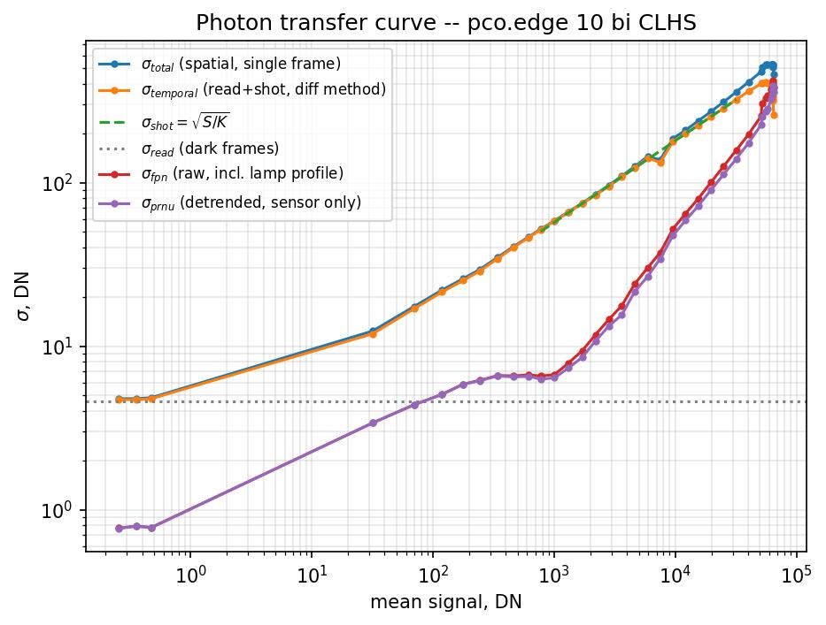
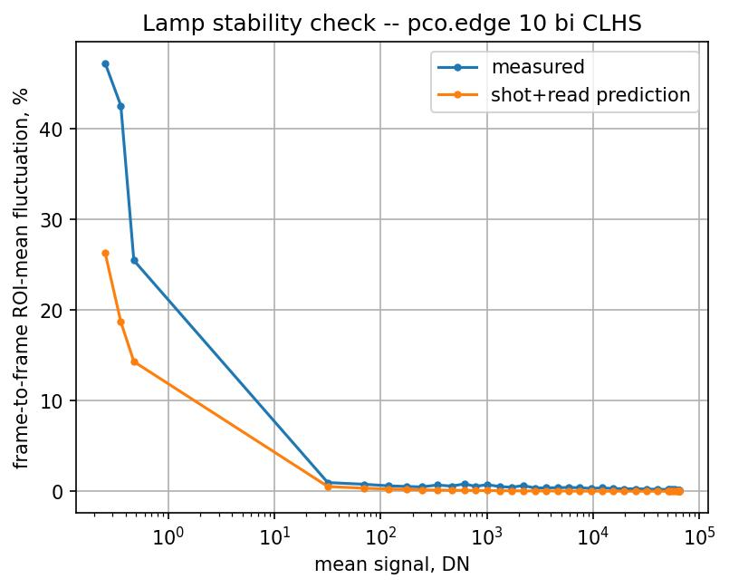
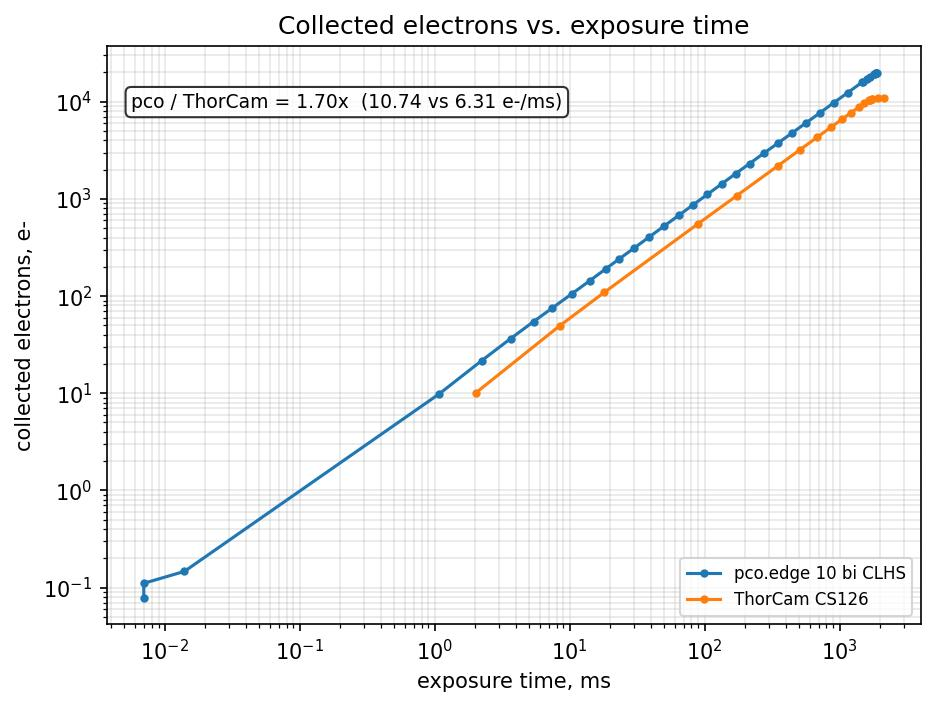
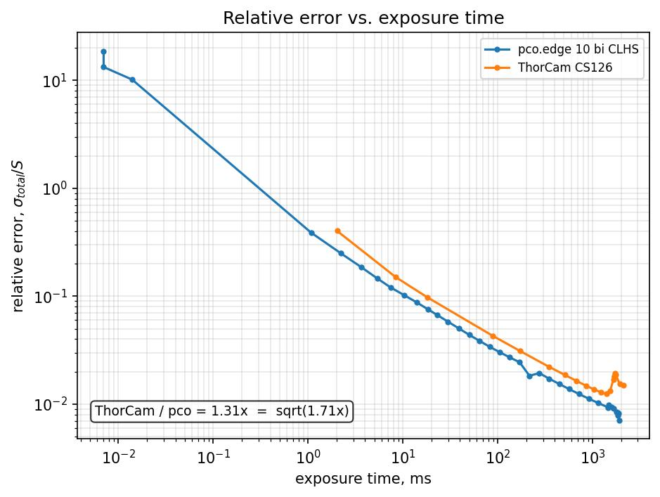
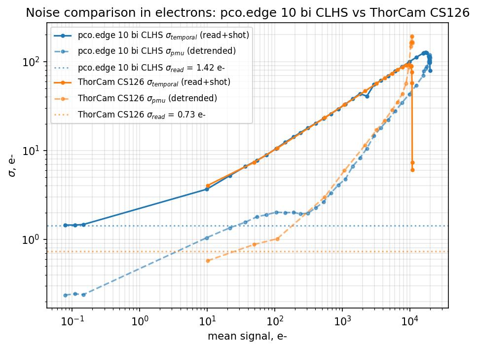

# Photon Transfer Curve — pco.edge 10 bi CLHS Noise Decomposition

## Setup

Following the same two-frame-difference method as the ThorCam analysis
([`photon_transfer.md`](photon_transfer.md)), we recorded bright/dark frame stacks for
the pco.edge 10 bi CLHS (serial `22500190`) across 38 illumination levels: a 30-level base
sweep spanning 0.1%–99.9% of full well (log-spaced target fractions), plus an 8-level
extension densely filling 80%–99% of full well. For each level: 50 bright frames (filter
wheel open) and 50 dark frames (filter wheel closed, back-to-back), both restricted in
hardware to the central 10% ROI and further cropped to the central 70×70 px sub-ROI in
analysis (the same ROI size validated vignetting-free for the ThorCam). Exposure at each
level was set by autoexposure, ranging 0.007–1897 ms. This camera has no gain control —
the `gain_range` field in the recorded data is a layout placeholder, not a real setting.
The camera was configured in **fast scan mode** — this is a camera-level readout setting
made outside this codebase (`instruments/pypcocam/pcocam.py` exposes no scan-mode setter,
and it is not recorded in the saved `.npz` metadata), so it is stated here rather than
derived from the data. Fast scan trades read noise for readout speed relative to the
camera's slower "normal"/low-noise scan modes; see the read-noise caveat below.
Acquisition: [`scripts/test/pco_noise_bright.py`](../scripts/test/pco_noise_bright.py). All
figures and numbers below are reproduced from
[`pco_noise_analysis.ipynb`](../data/20260729_Camera_noise/pco_noise_analysis.ipynb).

| Parameter | Value |
|---|---|
| Serial | `22500190` |
| Signal levels | 38 (30 base, 0.1%–99.9%; 8 extension, 80%–99%, densely sampled) |
| Frames per level | 50 (bright), 50 (dark) |
| ROI | central 70×70 px (of a central-10%-of-sensor hardware ROI) |
| ADC full-scale (`pixel_max`) | 65,535 DN (16-bit) |
| Exposure range | 0.007–1897 ms (autoexposure) |
| Readout mode | fast scan |
| Gain control | none |
| Dark subtraction | master dark (mean of 50 dark frames per level) |

The base and extension acquisitions overlap at the top end (base's last level reaches
64,493 DN at 1852 ms; the extension spans 51,965–64,920 DN over 1486–1897 ms) and the
extension frames are 8 px wider than the base frames (448 vs. 440 px) — both stacks are
concatenated, the extension is cropped symmetrically to match the base ROI center, and
the combined levels are sorted by exposure before analysis so every vs.-exposure plot
reads monotonically. The three shortest exposures are pinned at the 7 µs hardware
minimum and sit at only ~0.1–0.5 DN of *light* signal above the dark pedestal — the left
end of the curve, not a measurement error.

## Noise Model

Identical model to the ThorCam analysis — see
[`photon_transfer.md`, "Noise Model"](photon_transfer.md#noise-model) for the full
derivation. In short:

```
sigma_total^2 = sigma_read^2 + sigma_shot^2 + sigma_fpn^2
```

with `sigma_read` the signal-independent read-noise floor, `sigma_shot = sqrt(S/K)` the
photon shot noise, and `sigma_fpn = P_N * S` the fixed-pattern noise. The two-frame
difference method (`sigma_temporal^2 = var(F1 - F2)/2`, mean-subtracted per pair) isolates
`sigma_read + sigma_shot` from FPN and from lamp flicker; `sigma_fpn` is then recovered by
quadrature subtraction from the single-frame spatial std, `sigma_total`.

## Conversion Gain and Read Noise

`K` is fit from `sigma_temporal^2 = sigma_read_var + S/K`, restricted to the linear shot
region (1%–60% of full well). Read noise is measured directly from the dark-frame stacks
(two-frame difference method), not extrapolated from the PTC intercept.


**Figure 1.** Full noise decomposition: σ_total (spatial), σ_temporal (difference
method), σ_shot (fit), σ_read (dark-frame floor), σ_fpn (raw, quadrature), σ_prnu
(detrended, quadrature). Log-log.

| Quantity | Value | Source |
|---|---|---|
| Conversion gain, `K` | 0.308 e⁻/DN | fit (linear region) |
| Read noise (direct), **upper bound** | 4.614 DN (1.420 e⁻) | dark-frame difference, this dataset |
| Full well (`pixel_max * K`) | ≈20,200 e⁻ | ADC-clip upper bound |
| Dynamic range (`pixel_max / read noise`) | ≈14,200:1 (~83 dB), **conservative** | quantization-limited |

Unlike the ThorCam, there is no dedicated `pco_ptc_gain.py` / `pco_read_noise.py` sweep
for an independent cross-check of `K` and read noise yet — the values above come from this
single dataset only.

**Read noise is an upper bound, not a clean measurement, for this dataset.** The lamp was
bright enough that autoexposure hit the camera's 7 µs hardware exposure minimum before
reaching the dimmest target signal levels — the three shortest-exposure levels are all
pinned at 7 µs (two of them) and 14 µs rather than continuing to shrink with target
fraction. This dataset was never designed to isolate read noise the way a dedicated
minimum-exposure dark sweep would, so it doesn't cleanly reach the read-noise floor.
Compounding this, the dark-frame *mean* at the short-exposure end **decreases** with
exposure (101.03 → 100.82 → 100.69 → 100.34 DN over 7 µs → 7 µs → 14 µs → 1076 µs) — the
opposite of what dark current would produce — so the minimum-exposure dark frames are not
behaving as a clean, stable read-noise reference either. `sigma_read` = 4.614 DN is
therefore reported as an upper bound; a dedicated read-noise sweep (the pco analogue of
[`scripts/test/thorcam_read_noise.py`](../scripts/test/thorcam_read_noise.py), which
doesn't exist yet for this camera) is needed for a real number, and would also let a
lower-noise scan mode be checked against fast scan mode (Setup, above).

## Fixed-Pattern Noise: Raw vs. Detrended

As with the ThorCam, the raw `sigma_fpn` includes both sensor PRNU and the lamp's own
spatial illumination profile across the ROI; subtracting a low-order 2D polynomial
(fit per level from the mean image) isolates true pixel-to-pixel PRNU as `sigma_prnu`.

| Quantity | Value |
|---|---|
| PRNU factor, `P_N` (detrended, sensor-only) | ≈0.44% of signal |
| Raw FPN factor (includes lamp profile) | ≈0.50% of signal |

The gap between raw and detrended is narrower here than for the ThorCam (0.44% vs. 0.50%,
compared to 0.53% vs. 0.60%) — for this camera the raw curve is nearly indistinguishable
from PRNU except very close to full well (Figure 1, upper right), where the lamp/vignetting
gradient becomes visible in both cameras' data.

## Lamp Stability Check


**Figure 2.** Measured frame-to-frame ROI-mean fluctuation (%) vs. the shot+read-noise
prediction, across signal levels.

The measured curve sits above the shot-noise prediction at every level, by
**~0.07–0.21%** at high signal (and much more at very low signal, where the percentage is
dominated by the read floor and the ROI mean is only a few DN above the dark pedestal).
As with the ThorCam, this lamp flicker does not corrupt `sigma_temporal` in Figure 1,
because mean-subtracting each difference image removes exactly this common-mode
fluctuation before the variance is taken.

## Camera Comparison: pco.edge 10 bi CLHS vs. ThorCam CS126

Both cameras were run under the same lamp and analysis pipeline
(`noise_decomposition()` in `pco_noise_analysis.ipynb`, applied identically to both), so
the numbers below are directly comparable. DN values are *not* comparable between the two
cameras — `K` differs by a factor of ~8.6 (0.308 vs. 2.660 e⁻/DN) — so all noise
comparisons below are converted to electrons.

| Quantity | pco.edge 10 bi CLHS | ThorCam CS126 |
|---|---:|---:|
| Conversion gain, `K` (e⁻/DN) | 0.3078 | 2.6596 |
| Signal rate at matched exposure (e⁻/ms) | **10.74** | **6.31** |
| Read noise (DN), pco is an **upper bound** | 4.614 | 0.275 |
| Read noise (e⁻), pco is an **upper bound** | 1.420 | 0.731 |
| Full well (e⁻) | ≈20,200 | ≈10,900 |
| Dynamic range (dB), pco is **conservative** | ≈83.0 | ≈83.5 |
| PRNU factor, `P_N` | ≈0.44% | ≈0.51% |
| ADC | 16-bit (65,535 DN) | 12-bit (4,095 DN) |
| Readout mode | fast scan | (see `photon_transfer.md`) |
| ROI / frame size | 236×440–448 px | 300×408 px |

The pco's read-noise and dynamic-range figures carry the same upper-bound caveat as in the
"Conversion Gain and Read Noise" section above — the pco values in this table may overstate
its read noise (understate its dynamic range) relative to a dedicated measurement.

(ThorCam figures in this table come from a 20-level subset used specifically for this
comparison and agree with the full 26-level sweep in `photon_transfer.md` to <3%.)

### Signal rate and sensitivity


**Figure 3.** Collected electrons (mean signal × each camera's own `K`) vs. exposure
time, under identical lamp illumination. Annotated with the headline ratio.

**At the same exposure time, the pco collects 1.70× more photoelectrons than the ThorCam**
(10.74 vs. 6.31 e⁻/ms — an origin-forced linear fit of electrons vs. exposure time, each
camera restricted to its own 1%–60%-of-full-well linear region). This is a single, flat
ratio: computed pointwise over the exposure range where both cameras are in their linear
region (23–860 ms), it stays within 1.70–1.72× at every point. The advantage reflects some
combination of pixel size, quantum efficiency, and the different ROI/optical coupling
between the two acquisitions; with ~1.9× the full well on top of the faster collection
rate, the pco also keeps accumulating for longer before saturating.

### Relative error vs. exposure time


**Figure 4.** Single-frame relative error (σ_total / S) vs. exposure time, both cameras.
Annotated with the headline ratio.

**At the same exposure time, the pco's relative error is 1.31× lower than the ThorCam's**
(pointwise over the same 23–860 ms linear-region overlap, range 1.28–1.45×). This is not
an independent effect: `sqrt(1.708) = 1.307` — the accuracy advantage is exactly the
shot-noise consequence of the signal-rate advantage in Figure 3. Per collected electron,
the two cameras are equally accurate; the pco is simply ahead because it collects
electrons faster. Both curves converge toward the same PRNU-limited floor (~0.4–0.5%) at
long exposure, where fixed pattern noise rather than shot noise dominates.

### Noise in electrons


**Figure 5.** σ_temporal (read+shot) and σ_prnu (detrended), both in electrons, vs. mean
signal in electrons, for both cameras, with each camera's electron-referred read-noise
floor as a dashed horizontal line.

In electrons, the pco's read-noise floor (1.42 e⁻, an **upper bound** — see the caveat
above) sits about 2× above the ThorCam's (0.73 e⁻) — on this dataset the pco appears
noisier at low signal, though a dedicated read-noise sweep could narrow that gap. The two σ_temporal curves
converge onto the same shot-noise slope once the read floor is left behind, and the two
σ_prnu curves track closely across the shared signal range, consistent with the similar
`P_N` values in the table above. The apparent spike in the ThorCam σ_temporal curve near
its top signal levels is sampling noise from that dataset's few near-saturation levels,
not a measurement artifact.

### Which camera for which measurement

- **At matched exposure time**, the pco reaches a **1.31× lower relative error** than the
  ThorCam across the shared linear-region range (Figure 4) — the shot-noise consequence of
  collecting **1.70× more electrons** per unit exposure (Figure 3). Combined with ~1.9× the
  full well, it also saturates later, extending this advantage to longer exposures /
  brighter scenes.
- **At matched signal (electron count)** rather than matched exposure time — e.g. a
  frame-rate-limited application where exposure can't simply be extended — the ThorCam's
  lower read-noise floor (0.73 vs. an **upper-bound** 1.42 e⁻ for the pco, Figure 5) would
  give it the edge in the read-noise-dominated regime, at very low electron counts; a
  dedicated pco read-noise sweep is needed to say by how much.
- **PRNU-limited accuracy** (long averaging, flat-fielded or ratio measurements) is
  essentially a wash — both cameras plateau at a similar ~0.4–0.5% PRNU floor.

## Conclusions

- Both cameras follow the same Janesick noise model; the main practical difference is the
  ~8.6× larger conversion gain step (fewer, noisier electrons per DN) and (at most, see the
  read-noise caveat below) ~2× larger read noise in electrons for the pco, traded against
  ~1.9× more full well and a measured **1.70×** faster electron-collection rate at matched
  exposure time — which alone accounts for the pco's **1.31×** lower relative error at
  matched exposure (`sqrt(1.70) = 1.31`).
- Lamp noise is real but secondary for the pco, as it was for the ThorCam: ~0.1–0.2%
  temporal flicker (removed by mean-subtracting each difference pair) and a small spatial
  illumination gradient across the ROI (removed by polynomial detrending before computing
  PRNU).

**Derived constants (this camera, serial `22500190`, fast scan mode, no gain control):**

| Constant | Value |
|---|---|
| Conversion gain, `K` | **0.308 e⁻/DN** |
| Read noise, `sigma_read` — **upper bound** | **4.614 DN ≈ 1.420 e⁻** |
| Full well | **≈20,200 e⁻** (`pixel_max × K`, ADC-clip bound) |
| Dynamic range — **conservative** (uses the upper-bound read noise) | **≈14,200:1 (~83 dB)** |
| PRNU factor, `P_N` (sensor only) | **≈0.44%** of signal |
| Raw FPN factor (incl. lamp profile) | **≈0.50%** of signal |
| Lamp temporal instability (excess) | **≈0.07–0.21%** frame-to-frame at high signal |
| Signal rate vs. ThorCam CS126, at matched exposure | **1.70×** more e⁻/ms |
| Relative-error ratio vs. ThorCam CS126, at matched exposure | **1.31×** lower |

## Fast Error Estimation

Same estimators as [`photon_transfer.md`](photon_transfer.md#fast-error-estimation),
re-derived with this camera's constants. `S` is mean signal in DN, `N` is the number of
frames averaged. Because `sigma_read` is an upper bound (see the read-noise caveat
above), `eps_int` below is **conservative** — it will overstate the true error somewhat
at low signal, where the read term matters most. The `eps_T` transmission-ratio formulas
and the quick-reference table are shot-noise-dominated in the signal range this camera is
normally used at and are effectively unaffected.

### Per-pixel intensity, single ROI

```
eps_int(S, N) [%] = 100 * sqrt( (21.29 + 3.249*S)/N + (0.00442*S)^2 ) / S
```

- `21.29 = sigma_read^2` (**upper bound** — see the read-noise caveat above), `3.249 = 1/K`
  (DN²/DN, shot term), `0.00442 = P_N` (PRNU).
- Shot-limited quick form (valid above a few hundred DN, single frame):
  `eps_int ≈ 180.3/sqrt(S)  %`.
- **Averaging floor:** the `0.00442*S` (PRNU) term does not shrink with `N`. Beyond a few
  hundred frames, per-pixel intensity error stalls at **≈0.44%**, no matter how long you
  average. Only flat-fielding / referencing removes it (next section).

### Transmission ratio (the metasurface case)

For `T = S_sample / S_ref`, the fixed per-pixel PRNU term cancels in the ratio and the
error is purely temporal (shot+read):

```
eps_T(S_s, N_s, S_r, N_r) [%] = 100 * sqrt( 1/(K*S_s*N_s) + 1/(K*S_r*N_r) )
```

Dim/shot-limited single-term approximation (reference much brighter/better averaged than
the sample, so the sample term dominates):

```
eps_T [%] ≈ 180.3 / sqrt(S_s * N_s)                 (S_s = sample/transmitted signal, DN)
N_s (for target eps%) ≈ 32,494 / (S_s * eps%^2)
```

### Quick-reference table

| S (DN) | eps_int, 1 frame (%) | eps_T, 1 frame (%) | N for eps_T = 0.5% | N for eps_T = 0.1% |
|---:|---:|---:|---:|---:|
| 1000  | 5.74 | 5.70 | 130 | 3249 |
| 5000  | 2.59 | 2.55 | 26  | 650  |
| 10000 | 1.86 | 1.80 | 13  | 325  |
| 20000 | 1.35 | 1.27 | 6   | 162  |
| 40000 | 1.00 | 0.90 | 3   | 81   |
| 60000 | 0.86 | 0.74 | 2   | 54   |

### Worked example: 90%/5% transmission metasurface

Reference (no sample) exposed near full well, `S_ref ≈ 60,000` DN. Sample regions at 90%
and 5% transmission then sit at `S_s ≈ 54,000` DN and `S_s ≈ 3000` DN respectively. Using
the full two-term formula with `N_s = N_r = N`:

| Region | `S_s` (DN) | N for 0.5% | N for 0.1% |
|---|---:|---:|---:|
| 90% transmission | 54,000 | ~2   | ~60   |
| 5% transmission  | 3,000  | ~43  | ~1083 |

**The dimmest region sets the averaging budget.** If both regions must hit the same target
accuracy in the same acquisition, average by the 5%-transmission requirement (~43 frames
for 0.5%, ~1083 frames for 0.1%) — the bright region is already far better than needed at
that frame count. Compared to the ThorCam worked example (~90/~2200 frames for the same
targets at 5% transmission), the pco needs roughly 2× fewer frames for the same accuracy at
a given transmission fraction of full well — a direct consequence of its larger full well
putting more electrons behind the same DN fraction, partly offset by its larger `1/K`.

### Reference recap

```
sigma_total^2    = sigma_read^2 + sigma_shot^2 + sigma_fpn^2
sigma_shot       = sqrt(S / K)                      [DN]
sigma_fpn        = P_N * S                          [DN]     -- fixed, does not average down
S_electrons      = S_DN * K
```
